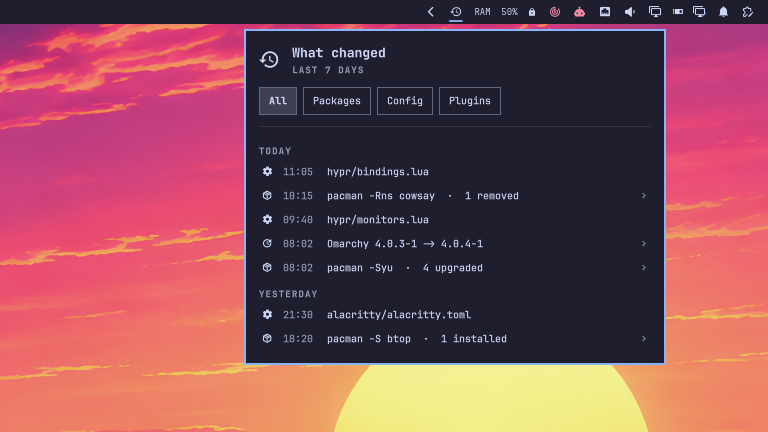

# What changed

A history icon in the Omarchy bar. Click it and you get a timeline of what changed on this machine lately, newest first and grouped by day: pacman transactions, config files you edited, plugins you installed or updated, and Omarchy updates.



## Why

It worked yesterday. What did I touch? The answer is spread over `/var/log/pacman.log`, a pile of mtimes under `~/.config` and the git checkouts of your plugins. This puts them on one timeline.

## Install

```
omarchy plugin add https://github.com/Nejcc/omarchy-what-changed.git
```

Then add the "What changed" widget to the bar.

## Uninstall

```sh
omarchy plugin remove nejcc.what-changed
```

Nothing is left behind.

## Usage

- Click the icon to open the timeline. Click again or press Escape to close it.
- Filter with All / Packages / Config / Plugins (or left/right arrows). Plugins includes Omarchy updates.
- Click a package transaction to see every package in it (`↑` upgraded, `↓` downgraded, `+` installed, `−` removed, `↻` reinstalled, with old → new versions). Transactions that never completed show up in the urgent color.
- Click a config file to open it in your editor (`omarchy-launch-editor`, so it follows your Omarchy default editor).
- Click a plugin update to see the incoming commit subjects.
- `days` (default 7, up to 90) in the widget settings sets how far back it looks.

The script also works on its own:

```
bin/what-changed --days 3          # plain text
bin/what-changed --days 3 --json   # what the panel reads
```

## How it works

`bin/what-changed` runs once each time the panel opens, never on a timer. It is read-only and takes about 0.15 s for 7 days here.

- **Packages:** one pass over `/var/log/pacman.log` with gawk. Everything between `transaction started` and `transaction completed` is one entry, with the `Running '…'` command that started it. A transaction that is cut off (a new one starts, the log says it failed or was interrupted, or the log ends) is kept and marked.
- **Config:** files under `~/.config` modified inside the window, newest 80. Caches, browser and Electron profiles (any folder with `Cookies` or `Local State`), state, log, lock, database and image files are skipped; the ignore list is at the top of `config_files()` in the script.
- **Plugins:** the git reflog of each `~/.config/omarchy/plugins/<id>` checkout: clone = installed, merge/pull = updated, reset = rolled back. These are the times it happened on your machine, not upstream commit dates. A changed `shell.json` shows as "Plugins or bar layout changed", since enabling, disabling and moving widgets all rewrite it.
- **Omarchy:** `omarchy`/`omarchy-dev` package upgrades from the pacman log get their own entry, so does a dev checkout in `$OMARCHY_PATH` (via its reflog) and the last `omarchy update` run (`/tmp/omarchy-update.log`).

## Runtime dependencies

`bash`, `gawk`, GNU `find`/`sort`/`stat` and `git`, all part of a stock Omarchy install. Missing sources are skipped.

## Limits

- Config changes are mtimes, not diffs. It tells you *that* `hypr/bindings.lua` changed, not what changed in it.
- Plugin enable/disable is detected only as a `shell.json` change, not which plugin.
- Plugins installed without git show only their folder mtime.
- `omarchy update` runs older than the last reboot are only visible through their pacman transactions (`/tmp` is cleared on boot).
- The pacman log uses local time with an offset; old-style `[YYYY-MM-DD HH:MM]` lines are ignored.

## Tests

```
tests/what-changed.test.sh
```

Runs the script over `tests/fixture-pacman.log` (install, upgrade, remove, downgrade, an interrupted, a failed and an unfinished transaction) plus a fake `~/.config` and plugin reflog. Needs `jq`.

## License

MIT
